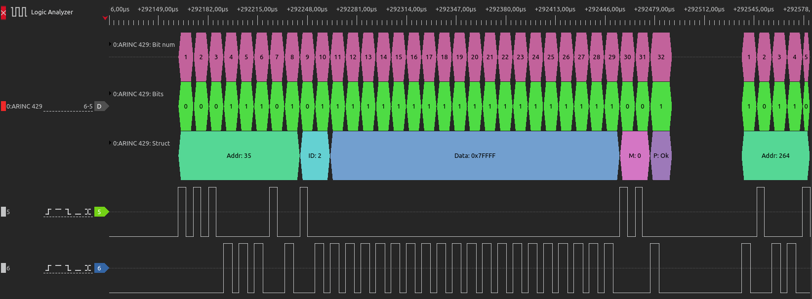
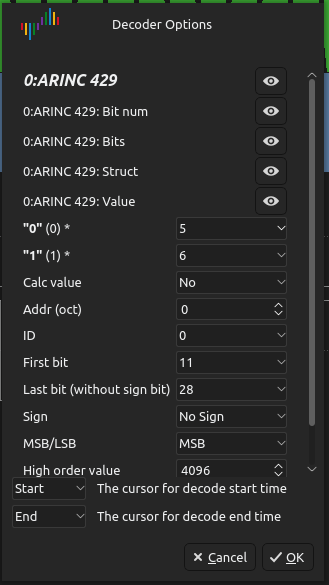

# Decoder (ARINC 429) plugin for  [DSView](https://github.com/DreamSourceLab/DSView)
For linux:
Copy pd.py to */usr/local/share/libsigrokdecode4DSL/decoders/arinc*. And create \_\_init\_\_.py empty.
## Important
**Sigrok** api_version = 3

