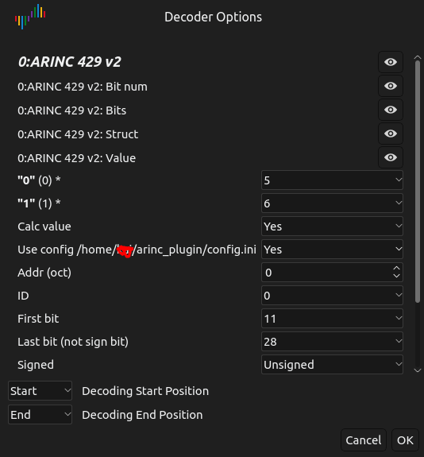
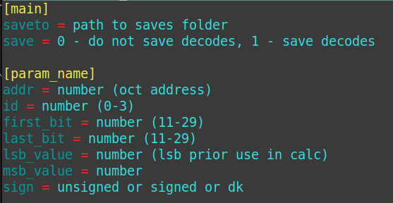

# Decoder (ARINC 429) plugin for  [DSView](https://github.com/DreamSourceLab/DSView)

For linux:
Copy pd.py to _/usr/local/share/libsigrokdecode4DSL/decoders/arinc_. And create \_\_init\_\_.py empty.

## Important

**Sigrok** api_version = 3

You can configure the decoding parameters of several parameters in the config.ini (will be created in _<user_home>/arinc_plugin/_ after clicking Ok with the "Use config" option selected) configuration file and save the result in .csv files

config.ini is located at `<user folder>/arinc_plugin/config.ini`

[on GitLab](https://gitlab.com/Aleksandr-Kai/DSView_ARINC429_Decoder) (forcing to turn on 2fa sucks. ms will kill github)
